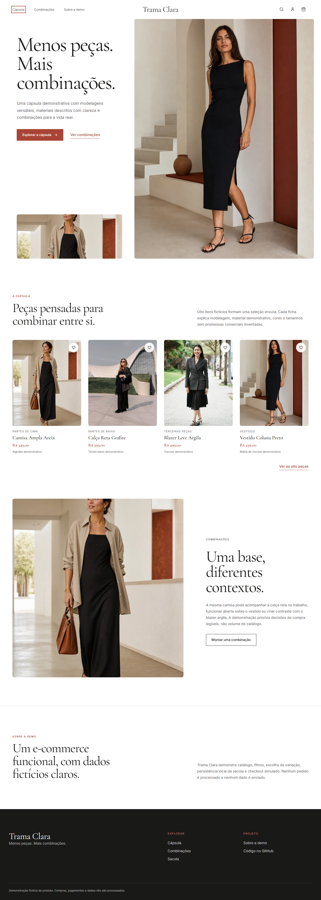

# Trama Clara

> Menos peças. Mais combinações.

Trama Clara é uma demonstração funcional de e-commerce para uma cápsula de moda feminina versátil. O projeto foi pensado para mulheres que buscam montar mais combinações com uma seleção menor e legível de peças.

Este é um produto fictício de portfólio. As peças, os dados de conta, os pedidos e o checkout são demonstrativos; nenhuma compra, cobrança ou transmissão de dados é realizada.

[Ver demonstração](https://loja-virtual-de-moda.vercel.app/) · [Abrir catálogo](https://loja-virtual-de-moda.vercel.app/catalogo)



## O que o projeto demonstra

- catálogo filtrável e ordenável com oito peças coerentes;
- seleção de cor, tamanho e quantidade;
- sacola persistida localmente entre recarregamentos;
- checkout em etapas, explicitamente simulado;
- conta fictícia com estados de pedido, favoritos, endereço e formulário;
- experiência responsiva em 1440×900 e 390×844;
- navegação por teclado, foco visível e controles nomeados;
- metadata social, canonical, favicon, robots e sitemap.

## Direção do produto

A identidade combina tipografia editorial com uma interface operacional limpa. Branco, carvão e argila mantêm a leitura clara; imagens próprias mostram as peças em contextos cotidianos, sem promoções, avaliações ou resultados comerciais inventados.

## Stack

- React 18, TypeScript e Vite;
- React Router;
- Tailwind CSS;
- Vitest e Testing Library;
- Playwright;
- GitHub Actions.

## Executar localmente

```bash
npm ci
npm run dev
```

## Validar

```bash
npm run typecheck
npm run lint
npm test
npm run build
npm run test:e2e
npm audit
```

O Playwright requer o Chromium instalado com `npx playwright install chromium`.

## Persistência e privacidade

A sacola usa apenas `localStorage`. Os formulários não enviam informações para servidores e não existem integrações de pagamento. Não use dados pessoais reais ao explorar a demonstração.

## Autor

[Hamilton Felipe Soares da Silva](https://github.com/LipDev-sudo)

## Licença

[MIT](LICENSE)
